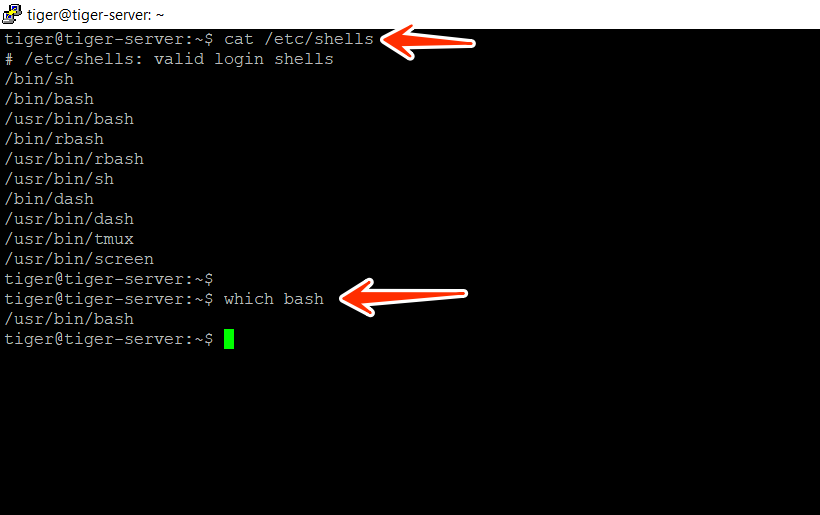
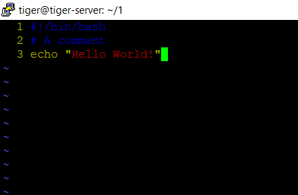

# [1. Introduction to Bash Scripting](#1-introduction-to-bash-scripting)

## [1.1 What is Bash?](#11-what-is-bash)

### [1.1.1 History and Purpose](#111-history-and-purpose)

- **Acronym**: BASH stands for _"Bourne Again Shell"_.
- **Created by**: Bash is a shell program developed by Brian Fox as an upgraded version of the Bourne Shell ('sh'). It is part of the open-source GNU project.
- **Enhancements**: Bash offers functional improvements over the Bourne Shell, including features such as command line editing, key bindings, and an unlimited command history.
- **Shell Script**: Users can combine commands in a series within a file, known as a Shell Script, which Bash can read and execute
- **Default Login Shell**: Bash is the default login shell for most Linux distributions and Apple's macOS.

### [1.1.2 Bash vs. Other Shells](#112-bash-vs-other-shells)

#### Bourne Shell (sh):

- Simpler and lightweight.
- Lacks advanced features.
- Bash is preferred for added functionality.

#### Korn Shell (ksh):

- Feature-rich and powerful.
- Personal preference between Bash and ksh.
- Bash is more common on Linux systems.

#### C Shell (csh):

- Different syntax (C-like).
- Bash is more user-friendly and feature-rich.
- Bash is often easier for new users to learn.

and many more shell.

<!--  -->

### [1.1.3 Know about your Shell](#113-know-about-your-shell)

1. Which shell types your operating system supports : `cat /etc/shells`
2. where bash is located in your OS : `which bash`



## [1.2 Writing Your First Bash Script](#12-writing-your-first-bash-script)

**Step 1>** Create a script file. `touch first-script.sh`.
**Step 2>** Open in vim editor `vim first-script.sh`, this also creats the file if it dosent exist.

**Step 3>** Write these three lines and give permission to the file with `chmod u+x first-script.sh` command.

**Step 4>** Execute the script file `./first-script.sh`.



##### Line 1 -> `#!/bin/bash`

- The She Bang (`#!`) is a character sequence consisting of the characters number sign (#) and exclamation mark (!) at the beginning of a script.
- It tells to interpret the rest of the lines with the interpreter `/bin/bash`.

##### Line 2 -> `# A comment`

- It is a single line comment.
- multi line comment
  ```bash
  <<COMMENTS
    abc
    xyz
  COMMENTS
  ```
  **or**
  ```bash
  : '
  This is the first comment
  This is the second comment
  This is the third comment
  '
  ```

##### Line 3 -> `echo "Hello World!"`

- `echo` is the command to print.
