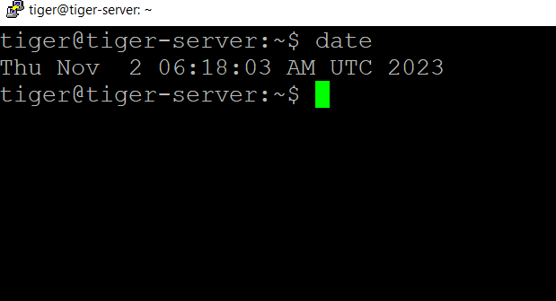
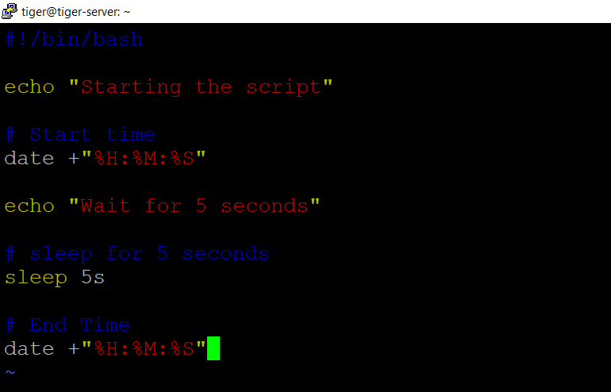
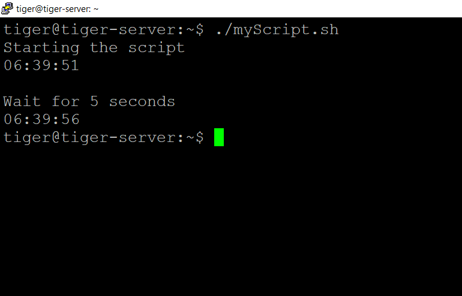

# [2. Bash Scripting Fundamentals](#2-bash-scripting-fundamentals)

## [2.1 Variables](#21-variables)

In Bash, you can declare and initialize variables as follows:

```bash
variable_name="value"
```

Here,
`variable_name` is the name of the variable, and
`"value"` is the value you want to assign to it.

Bash _doesn't require_ explicit data type declarations; it determines the data type based on the value you assign.

#### Naming conventions for variable names:

- Variable names should consist of letters, numbers, and underscores.
- They cannot start with a number.
- Variable names are case-sensitive, so `myVar` and `myvar` are treated as different variables.
- Variables declared outside of functions are global and inside a function are local.

### [2.1.1 Types of Bash Variables](#211-types-of-bash-variables)

#### i. System-Defined Variables

List of some commonly used system-defined variables in Bash.

1. `$HOME` -> Path to the current user's home directory.
2. `$USER` -> Current user's username.
3. `$PWD` -> Current working directory.
4. `$SHELL` -> Path to the current user's default shell.
5. `$PATH` -> Colon-separated list of directories where executable files are located.
6. `$PS1` -> Primary prompt string format for the command prompt.
7. `$PS2` -> Secondary prompt string format used for continued input.
8. `$HOSTNAME` -> Hostname of the system.
9. `$UID` -> User ID of the current user.
10. `$EUID` -> Effective user ID (may differ when elevated privileges are used).
11. `$RANDOM` -> Generates a random integer between 0 and 32767.
12. `?` -> Exit status of the last executed command (0 for success, non-zero for failure).
13. `$$` -> Process ID (PID) of the current shell.
14. `$IFS` -> Internal Field Separator used for word splitting.
15. `$OLDPWD` -> Previous working directory.
16. `$HISTSIZE` -> Maximum number of commands stored in the command history.
17. `$HOSTTYPE` -> Machine or hardware type of the system.
18. `$OSTYPE` -> Operating system type (e.g., "linux-gnu" on Linux).
19. `$MACHTYPE` -> Machine type (e.g., "x86_64" for a 64-bit system).
20. `$SHLVL` -> Current shell session's nesting level.
21. `$GROUPS` -> Array containing group IDs of the user.
22. `$LOGNAME` -> User's login name.
23. `$MAIL` -> Path to the user's mailbox.
24. `$MAILCHECK` -> Interval for checking new mail.
25. `$PAGER` -> Default pager program for viewing long text files.
26. `$TMOUT` -> Shell session timeout setting.
27. `$LINENO` -> Current line number in a script.
28. `$PIPESTATUS` -> Array storing exit statuses of commands in a pipeline.
29. `$FUNCNAME` -> Array with the names of shell functions in the call stack.
30. `$SECONDS` -> Time in seconds since the script started.
31. `$GLOBIGNORE` -> Patterns to ignore during pathname expansion.

#### ii. User-Defined Variables

```bash
#! /bin/bash
# User-Defined Variables
name=rocky
ROLL_NO=47
echo "The student name is $name and his Roll number is $ROLL_NO."
```

Here, `ROLL_NO` variable is user defined.

## [2.2 Input and Output](#22-input-and-output)

### [2.2.1 Command-Line Arguments](#221-command-line-arguments)

When you run a Bash script, you can include arguments after the script's name. For example:

```bash
./myscript.sh arg1 arg2 arg3
```

In this example, arg1, arg2, and arg3 are the command-line arguments. Here's are some common Command-Line Arguments in Bash script:

- `$0` -> The name of the Bash script.
- `$1` - `$9` -> The first 9 arguments to the Bash script. (As mentioned above.)
- `$#` -> How many arguments were passed to the Bash script.
- `$@` -> All the arguments supplied to the Bash script.
- `$?` -> The exit status of the most recently run process.
- `$$` -> The process ID of the current script.
- `$USER` -> The username of the user running the script.
- `$HOSTNAME` -> The hostname of the machine the script is running on.
- `$SECONDS` -> The number of seconds since the script was started.
- `$RANDOM` -> Returns a different random number each time is it referred to.
- `$LINENO` -> Returns the current line number in the Bash script.

### [2.2.2 User Input - `read` command](#222-user-input---read-command)

```bash
#!/bin/bash

echo "Enter your name: "
read name
echo "Hello, $name!"
```

### [2.2.3 Displaying Output - `echo` Command](#223-displaying-output---echo-command)

#### 1. Using the `echo` Command:

The `echo` command is the simplest way to display output in Bash.

```bash
echo "Hello, world!"
```

You can also use options with echo, such as `-e` to interpret escape sequences or `-n` to suppress the trailing newline:

```bash
echo -e "Line 1\nLine 2"
echo -n "This message won't end with a newline"
```

The `-e` option allows you to include special characters like `\n` for a newline.

#### 2. Using the `printf` Function:

The printf function provides more control over the format and layout of your output. It is similar to the printf functions in C and other programming languages.
The basic syntax is:

```bash
printf "Format String" [Arguments...]
```

In this example, the format string contains placeholders like %s for strings and %d for integers, which are replaced by the corresponding arguments.

```bash
name="Bob"
age=25
printf "Name: %s\nAge: %d\n" "$name" "$age"
```

##### Formatting Options in `printf`:

- `%s` : String
- `%d` : Integer
- `%f` : Floating-point number
- `%c` : Character
- `%x` : Hexadecimal

### [2.3 Date](#23-date)

To read more about `date` command, [click here](<[#](https://www.javatpoint.com/bash-date-format)>).



### [2.4 Sleep](#24-sleep)

- Sleep is a command-line utility which allows us to suspend the calling process for a specified time.
- In other words, Sleep command delay or pause the execution for a specified period of time.

Syntax for the sleep command:

```bash
sleep number[suffix]
```

**suffix** :-

- s -> seconds
- m -> minutes
- h -> hours
- d -> days

Example showing sleep command.




[← Previous Day](../Day-1/1-Introduction.md) || [Index](../README.md) || [Next Day →](../Day-3/)
